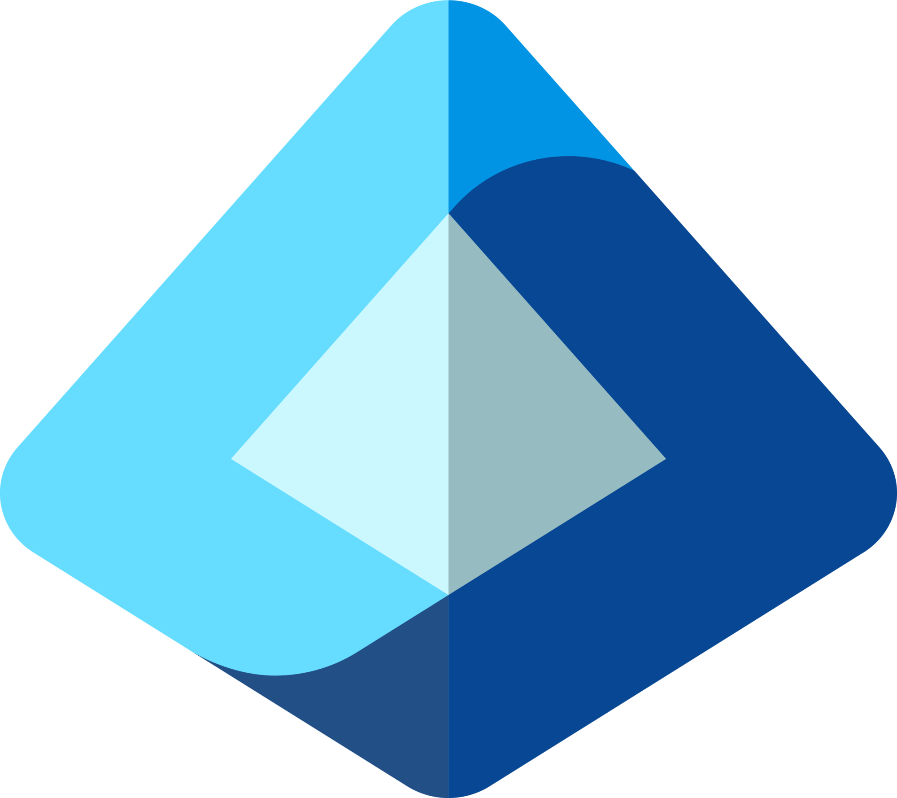

# 👋 Hi, I'm Keshav Raj Gautam  

🚀 **Cloud & DevOps Engineer | Azure Certified | IAM Specialist**  
🇮🇳 Based in India | Passionate about scalable cloud infra, DevOps automation & security  

---

## 🛠️ Tech Stack  

<table>
  <tr>
    <td align="center" width="80"> Azure</td>
   <td align="center" width="80">
   Entra ID
</td>
    <td align="center" width="80"> Jenkins</td>
    <td align="center" width="80"> GitHub</td>
    <td align="center" width="80"> Git</td>
  </tr>
  <tr>
    <td align="center" width="80"> Terraform</td>
    <td align="center" width="80"> Kubernetes</td>
    <td align="center" width="80"> Docker</td>
    <td align="center" width="80">
   Bash
</td>
    <td align="center" width="80"> Ansible</td>
  </tr>
  <tr>
    <td align="center" width="80"> Prometheus</td>
    <td align="center" width="80"> Grafana</td>
    <td></td><td></td><td></td>
  </tr>
</table>

---

## 📜 Certifications  

  
  
  
  

---

## 📂 Featured Projects  

### [Cloud Resume Challenge – Azure Deployed Resume Website](https://github.com/keshav-raj-gautam/Cloud-resume-challenge)  
Personal Resume Website with Visitor Counter and CI/CD Automation  

**Tools:** Azure Storage, Azure Function App, Cosmos DB, Terraform, Jenkins, Ngrok, GitHub  

- Developed a personal resume website hosted on Azure Storage with a live visitor counter  
- Implemented the visitor counter using an Azure Function App connected to Cosmos DB  
- Wrote Infrastructure as Code in Terraform with reusable modules for Storage, Function App, and Cosmos DB  
- Built a Jenkins CI/CD pipeline triggered via GitHub webhook to automate infrastructure provisioning and frontend deployment  
- Configured the pipeline to update the Function URL, deploy frontend changes, and send email notifications upon success  
- Exposed local Jenkins server using Ngrok for webhook integration and seamless GitHub triggering

---

### [ Wanderlust – Kubernetes-Deployed Travel Blogging App](https://github.com/keshav-raj-gautam/wanderlust)  
3-Tier Web Application Deployment on Kubernetes
**Tools:** Docker, Jenkins, ArgoCD, Prometheus, Grafana, GitHub  
- Deployed a containerized 3-tier app using CI/CD pipelines on a local Kind Kubernetes cluster.  
- Created Jenkins pipelines to build, tag, and push Docker images to Docker Hub.  
- Implemented GitOps workflows using ArgoCD to automate deployments on manifest updates.  
- Integrated GitHub Webhooks for automatic pipeline triggering.  
- Set up monitoring using Prometheus and Grafana with custom dashboards.  
- Configured email alerts for deployment success and failures.  

---

### [Azure 3-Tier Web Application Deployment](https://github.com/keshav-raj-gautam)
Azure 3-Tier Web Application Deployment (Terraform | Docker | VMSS)
- Provisioned a complete 3-tier architecture on Azure using Terraform for infrastructure-as-code.
- Created a VNet with four subnets (App Gateway, frontend, backend, DB) for secure network segmentation.
- Deployed VM Scale Sets (VMSS) in each tier to host Docker containers.
- Configured Azure Application Gateway with a public IP to route traffic to the frontend tier securely.
- Set up internal load balancers and Private DNS Zone for seamless communication between tiers.
- Automated container setup with Ansible playbooks using a jumpbox

---

## 📈 Activity Graph

  

---

## 📫 Connect with Me  

)  
  

---
